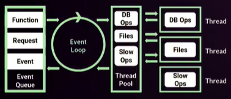

# FUNDAMENTOS DE NODE JS

## Conceptos basicos

### Origenes y Filosofia

NodeJS es un entorno de ejecución de JavaScript fuera del navegador. Se crea en 2009, orientado a servidores. Es muy importante que esté fuera del navegador debido a que ya no es necesario un navegador web para ejecutar código JavaScript.

**Características principales de JavaScript:**

- *Concurrencia:* Es monohilo, con entradas y salidas asíncronas.

- *Motor V8:* Creado por Google en 2008 para Chrome. Escrito en C++. Convierte JS en código máquina en lugar de interpretarlo en tiempo real.

- Todo funciona en base a *Módulos*, que son piezas de código muy pequeñas que modularizan nuestros sistemas y ayudan a entender mejor el código.

- *Orientación a Eventos*, existe un bucle de eventos que se ejecuta constantemente. Lo que nos permite programar de forma reactiva, lo que quiere decir que podemos programar con la lógica de “Cuando sucede algo, se ejecuta esta parte de mi código y eso a su vez dispara otra parte”.

### EventLoop: asincrona por disenho

El EventLoop es un proceso con un bucle que gestiona, de forma asincrona, todos los eventos de tu aplicacion. Todo el rato esta ejecutandose. El bucle no se bloqueara.



Otros lenguajes como Php o Python son sincronos por lo que las instrucciones van una detras de la otra. Por lo que si tarda mas una. las demas tardaran en ejecutarse. En cambio Node js permite haacerlo en paralelo. Esto lo realiza el *Thread Pool* levantando un hilo nuevo para cada peticion.

### Monohilo: implicaciones en diseño y seguridad

PROCESO DE NODE

    1.- Va a abrirse un proceso, ese proceso es un proceso de node
    2.- Interpreta todo el archivo
    3.- Convertirlo a código maquina
    4.- Prepara todo lo que necesita para ejecutarse
    5.- Se ejecuta
    6.- Se cierra el proceso, y termina

DESVENTAJAS MONOHILO

    - Si no se manejan bien los errores y uno truena, ya no continua con los procesos posteriores
    - Debes estar pendiente de todo el código

### Configurar las variables de entorno en Node.js

```
process.env.NAME
```

### Herramientas para ser más felices: Nodemon y PM2

```
npm i -g nodemon
```

## Cómo manejar la asincronía

### Callbacks


### Callback Hell: refactorizar o sufrir

### Promesas

### Async/await

## Módulos del core

### Global

Modulos que ya vienen en js

```js
console.log(global)
console.log(process)
console.log(__dirname)
console.log(__filename)
global.miVariable = "valor"
```

### File system

El File System es uno de los módulos principales que nos ofrece Node, este modulo es aquel que nos permite operar directamente con los archivos de nuestro sistema, permitiéndonos crear, leer, editar o eliminar archivos de nuestra índole.
Es mu importante tener en cuenta que la mayoría de métodos de este modulo son asíncronos, pero también nos ofrecen su versión síncrona, la cual es muy poco recomendable a la hora de usar ya que puede bloquear el evento loop de Node.
Para poder usar este modulo lo debemos importar con require en una constante con el mismo nombre del módulo:


```js
const fs = require(‘fs’);
// Una vez importado podremos comenzar a usar los métodos que este módulo nos ofrece:
Fs.readFile(path, callback);
Fs.writeFile(path, content, callback)
Fs.unlink(path, callback)
```

### Console

### Errores (try / catch)

Cuando se genera un error, node propaga el error hacia arriba, hasta que esta es caputado. si el error no se captura node se detiene.

Siempre que sea posible debemos capturar todos los errores que se puedan generar en nuestros hilos.

```js
const badfunction = () => 5 + z;
try {
    badfunction()
} catch (error) {
    console.log('bad function ha fallado')
    console.error(error.message)
}
console.log('continuamos...')
```

Con una funccion async y dentro un setTimeout el codigo se rompera debido a que el setTimeout lleva a otro hilo y este no esta controlado

```js
function seRompeAsync() {
    setTimeout(() => 3 + z)
}

try {
    console.log('start');
    seRompeAsync()
    console.log('end');
} catch (error) {
    console.error('Vaya, algo se ha roto...')
    console.error(error.message)
}
```

Con la sgte funccion se captura el error.

```js
function seRompeAsync(cb) {
    setTimeout(() => {
        try {
            return 3 + z
        } catch (error) {
            cb(error);
        }
    })
}
```

### Procesos hijo (child process)

El módulo de procesos secundarios de Node.js (child_process) tiene dos funciones spawn y exec, mediante las cuales podemos iniciar un proceso secundario para ejecutar otros programas en el sistema.

La diferencia más significativa entre child_process.spawn y child_process.exec está en lo que spawn devuelve un stream y exec devuelve un buffer.

- Usa spawn cuando quieras que el proceso hijo devuelva datos binarios enormes a Node.
- Usa exec cuando quieras que el proceso hijo devuelva mensajes de estado simples.
- Usa spawn cuando quieras recibir datos desde que el proceso arranca.
- Usa exec cuando solo quieras recibir datos al final de la ejecución.

### Módulos nativos en C++

Se pueden ejecutar modulos de C++ desde node.

### HTTP

### OS

### Process

## Utilizar los módulos y paquetes externos

### Gestión de paquetes: NPM y package.json

### Construyendo módulos: Require e Import

### Módulos útiles

- *bcrypt* nos permite construir una plataforma de seguridad utilizando contraseñas encriptadas con Salt.
- *moment* es una librería que nos permite solventar estos problemas e implementa un sistema de manejo de fechas mucho más cómodo.
- *sharp* puede convertir imágenes grandes en imágenes JPEG, PNG más pequeñas y compatibles con la web de diferentes dimensiones.

### Datos almacenados vs en memoria

- La información en memoria esta pensada para ser escrita rapida pero borrada tambien rapida.
- La información almacenada en disco puede ser almacenada durante mucho mas tiempo pero es mucho mas lento escribir y leer en ellos.

### Buffers

### Streams

### Debugger

### Error First Callbacks

Un patrón que se sigue siempre en cualquier lenguaje y programa de devs es Error First Callbacks, esto quiere decir que siempre que tengamos un callback el primer parámetro debería ser el error.

*😭 Esto se usa por la convención de que todo puede fallar.*

Otro patrón típico es tener el callback es tener en el callback como la última función que se pasa. Aunque depende del caso.

```js
function asincrona(callback) {
    setTimeout(() => {
        try {
            let a = 3 + w
            callback(null, a)
        } catch (error) {
            callback(error)
        }
    }, 1000)
}

asincrona((err, dato) => {
    if (err) {
        console.error('Tenemos un error')
        console.error(err)
        return false

        // throw err
    }

    console.log(`Todo ha ido bien, mi dato es ${dato}`)
})
```

### Scraping

### Automatización de procesos

```
npm i -g gulp
npm i gulp gulp-server-livereload
nano gulpfile.js
```